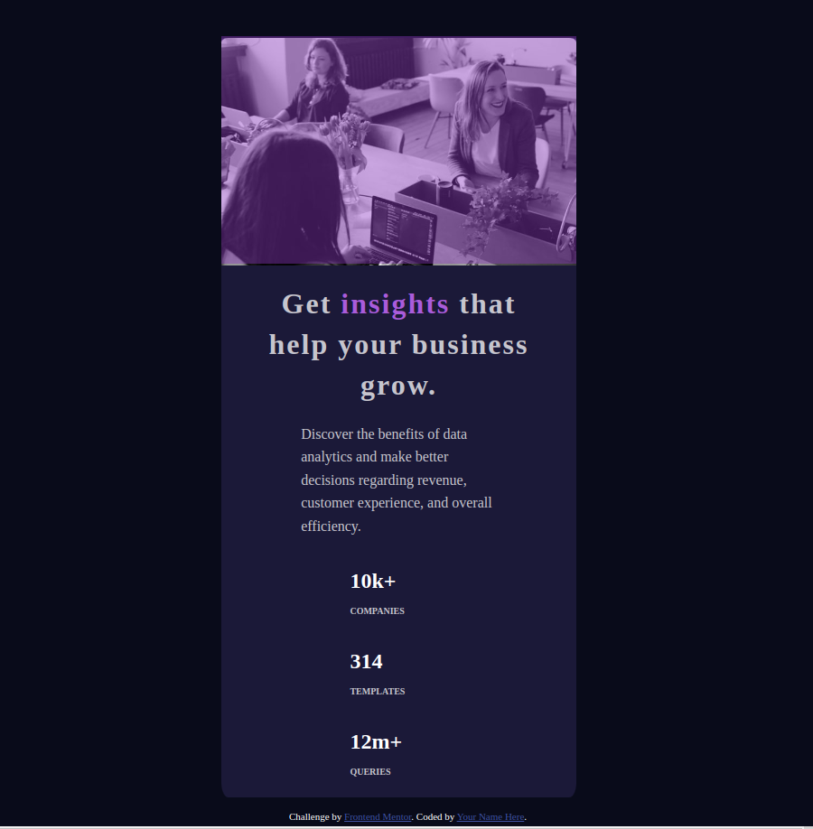

# Frontend Mentor - Stats preview card component solution

This is a solution to the [Stats preview card component challenge on Frontend Mentor](https://www.frontendmentor.io/challenges/stats-preview-card-component-8JqbgoU62). Frontend Mentor challenges help you improve your coding skills by building realistic projects.

## Table of contents

- [Overview](#overview)
- [The challenge](#the-challenge)
- [Screenshot](#screenshot)
- [Links](#links)
- [My process](#my-process)
- [Built with](#built-with)
- [Author](#author)

**Note: Delete this note and update the table of contents based on what sections you keep.**

### The challenge

Users should be able to:

- View the optimal layout depending on their device's screen size

### Screenshot

### Links

- Solution URL: [Add solution URL here](https://your-solution-url.com)
- Live Site URL: [Add live site URL here](https://your-live-site-url.com)

### Built with

- Semantic HTML5 markup
- CSS custom properties
- CSS variables
- Mobile-first workflow

### Built with

- Semantic HTML5 markup
- CSS custom properties

## Author

- myportfolio - [Katerina Sarantopoulou](https://myportfolio-katesarant.netlify.app/)
- Frontend Mentor - [@kate-sarant](https://www.frontendmentor.io/profile/kate-sarant)
- Github - [kate-sarant](https://github.com/kate-sarant)
